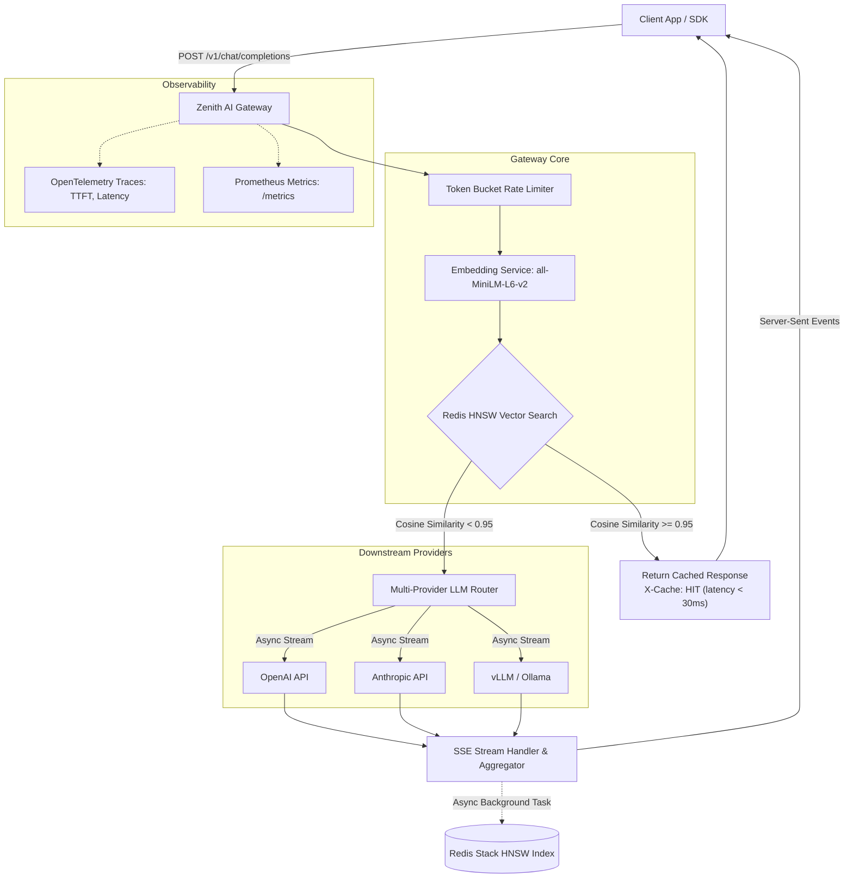

# ⚡ Zenith AI Gateway

[](https://www.python.org/)
[](https://fastapi.tiangolo.com/)
[](https://redis.io/)
[](LICENSE)

**Zenith AI Gateway** is a high-throughput, sub-30ms latency asynchronous reverse proxy situated between client applications and downstream LLM providers (Anthropic Claude, OpenAI, and local Ollama/vLLM instances).

---

## 🏛️ System Architecture



---

## ✨ Key Features

1. **Sub-30ms Semantic Caching (Redis Stack HNSW Vector Index)**:
   - Encodes prompt into 384-dimensional dense vectors using `sentence-transformers/all-MiniLM-L6-v2` loaded once in memory.
   - Non-blocking CPU encoding executed via `asyncio.to_thread`.
   - Redis Stack HNSW vector indexing with `COSINE` distance metric.
   - Cache hit threshold: $\text{Cosine Similarity} \ge 0.95$ ($d \le 0.05$).
   - Returns header `X-Cache: HIT` and `X-Cache-Similarity: <score>`.
2. **Streaming & Server-Sent Events (SSE)**:
   - Full OpenAI-compatible `/v1/chat/completions` endpoint supporting `stream=True` and `stream=False`.
   - Simulates streaming on cached hits for consistent client SDK streaming experience.
   - Real-time token streaming with async completion caching upon stream termination.
3. **Multi-Tenant Token-Bucket Rate Limiter**:
   - Atomic Redis Lua script enforcing token quotas per tenant/API key.
   - Automatic HTTP 429 status code with `Retry-After` headers on quota exhaustion.
4. **LLMOps & Distributed Tracing**:
   - OpenTelemetry spans for `cache_lookup_latency_ms`, `generate_embedding`, and Time to First Token (`TTFT`).
   - Prometheus metrics at `/metrics` tracking throughput, hit rates, token volume, and active requests.
5. **Resilience & Graceful Degradation**:
   - If Redis Stack is temporarily unreachable, the gateway automatically degrades to direct LLM passthrough mode without failing client requests.

---

## 📁 Repository Structure

```
zenith-ai-gateway/
├── docker-compose.yml              # Multi-container orchestration (Gateway + Redis Stack)
├── Dockerfile                      # Production container image with preloaded models
├── requirements.txt                # Python dependencies
├── .env.example                    # Environment configuration template
├── .gitignore                      # Git ignore rules
├── README.md                       # Documentation & Quickstart
├── app/
│   ├── __init__.py
│   ├── main.py                     # FastAPI app factory and lifespan management
│   ├── config.py                   # Pydantic Settings
│   ├── api/
│   │   ├── __init__.py
│   │   ├── deps.py                 # Dependency injection providers
│   │   ├── routes.py               # Chat completions, /healthz, /metrics
│   ├── core/
│   │   ├── __init__.py
│   │   ├── rate_limiter.py         # Redis Lua token bucket rate limiter
│   │   ├── telemetry.py            # OpenTelemetry & Prometheus setup
│   ├── schemas/
│   │   ├── __init__.py
│   │   ├── gateway.py              # Pydantic v2 request/response schemas
│   ├── services/
│   │   ├── __init__.py
│   │   ├── cache_service.py        # RediSearch HNSW vector cache service
│   │   ├── embedding_service.py    # Thread-safe Singleton sentence-transformers service
│   │   ├── llm_client.py           # Multi-provider async streaming router
└── tests/
    ├── __init__.py
    ├── conftest.py                 # Fixtures with async mocks
    ├── test_cache.py               # Semantic cache unit tests
    └── test_gateway.py             # End-to-end API and SSE streaming tests
```

---

## 🚀 Quickstart Guide

### 1. Run with Docker Compose (Recommended)

```bash
# 1. Clone repository and navigate to root
cd zenith-ai-gateway

# 2. Configure environment
cp .env.example .env
# Edit .env with your OPENAI_API_KEY or ANTHROPIC_API_KEY

# 3. Launch Redis Stack and Zenith AI Gateway
docker compose up --build -d

# 4. Check container health
curl http://localhost:8000/healthz
```

Access:
- **Zenith AI Gateway**: `http://localhost:8000`
- **RedisInsight UI**: `http://localhost:8001`
- **Prometheus Metrics**: `http://localhost:8000/metrics`

---

### 2. Run Locally for Development

#### Prerequisites
- Python 3.11+
- Running Redis Stack instance on port 6379 (`docker run -d -p 6379:6379 redis/redis-stack:latest`)

```bash
# 1. Create and activate virtual environment
python -m venv .venv
# On Windows:
.venv\Scripts\activate
# On Linux/macOS:
source .venv/bin/activate

# 2. Install dependencies
pip install -r requirements.txt

# 3. Start development server
uvicorn app.main:app --host 0.0.0.0 --port 8000 --reload
```

---

## 🧪 Testing

Execute the comprehensive test suite with `pytest`:

```bash
pytest tests/ -v
```

---

## 📡 API Usage & Examples

### 1. Standard Non-Streaming Chat Completion

```bash
curl -X POST http://localhost:8000/v1/chat/completions \
  -H "Content-Type: application/json" \
  -H "X-Tenant-ID: engineering-team" \
  -d '{
    "model": "gpt-4o",
    "messages": [
      {"role": "user", "content": "What is the speed of light in a vacuum?"}
    ],
    "temperature": 0.7
  }'
```

**Response (First Call - Cache Miss)**:
```json
{
  "id": "chatcmpl-b4e18d09c2a1",
  "object": "chat.completion",
  "created": 1717200000,
  "model": "gpt-4o",
  "choices": [
    {
      "index": 0,
      "message": {
        "role": "assistant",
        "content": "The speed of light in vacuum is approximately 299,792,458 meters per second."
      },
      "finish_reason": "stop"
    }
  ],
  "usage": {
    "prompt_tokens": 50,
    "completion_tokens": 15,
    "total_tokens": 65
  },
  "cache_hit": false
}
```
*Headers*: `X-Cache: MISS`

---

### 2. Semantic Cache Hit (Similar Query)

Send a semantically identical query with different phrasing:

```bash
curl -i -X POST http://localhost:8000/v1/chat/completions \
  -H "Content-Type: application/json" \
  -H "X-Tenant-ID: engineering-team" \
  -d '{
    "model": "gpt-4o",
    "messages": [
      {"role": "user", "content": "Tell me the speed of light in vacuum"}
    ]
  }'
```

*Response Headers*:
```http
HTTP/1.1 200 OK
X-Cache: HIT
X-Cache-Similarity: 0.9782
Content-Type: application/json
```
*Latency*: **< 20ms** (served entirely from Redis HNSW vector store without downstream API call).

---

### 3. Server-Sent Events (SSE) Streaming

```bash
curl -N -X POST http://localhost:8000/v1/chat/completions \
  -H "Content-Type: application/json" \
  -d '{
    "model": "gpt-4o",
    "messages": [
      {"role": "user", "content": "Write a 3-point summary of distributed consensus."}
    ],
    "stream": true
  }'
```

**Stream Output**:
```
data: {"id":"chatcmpl-a1","object":"chat.completion.chunk","created":1717200000,"model":"gpt-4o","choices":[{"index":0,"delta":{"role":"assistant"},"finish_reason":null}]}

data: {"id":"chatcmpl-a1","object":"chat.completion.chunk","created":1717200000,"model":"gpt-4o","choices":[{"index":0,"delta":{"content":"1. "},"finish_reason":null}]}

...

data: [DONE]
```

---

## 📊 Observability & Metrics

Prometheus exposition endpoint is exposed at `GET /metrics`. Key metrics tracked:

| Metric Name | Type | Description |
|---|---|---|
| `zenith_requests_total` | Counter | Total requests partitioned by `model`, `cache_status` (hit/miss), and `status_code` |
| `zenith_cache_latency_seconds` | Histogram | Latency histogram for Redis vector similarity lookup |
| `zenith_time_to_first_token_seconds` | Histogram | Time to First Token (TTFT) distribution for streaming calls |
| `zenith_tokens_total` | Counter | Total consumed/generated tokens partitioned by `token_type` |
| `zenith_active_requests` | Gauge | Instantaneous number of concurrent in-flight requests |

---

## 🛡️ License

Distributed under the MIT License.
